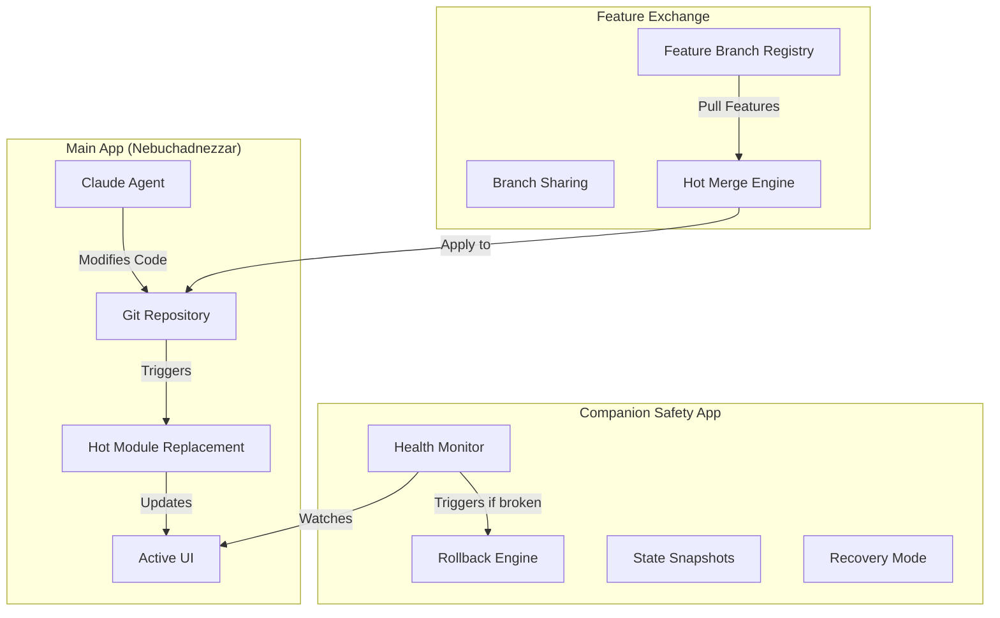

# Malleable Architecture: Self-Evolving Claude Code UI

## Executive Summary

Nebuchadnezzar becomes a **living, evolving application** that can modify itself through Claude agents, with git-based version control, feature branch sharing, and a companion safety app that ensures stability. Users can share feature branches with the community, and hot-merge improvements while the app is running.

## Core Concept



## 1. Self-Modification Architecture

### The Living Codebase

```typescript
class MalleableApp {
  private currentBranch: string = 'main';
  private featureBranches: Map<string, FeatureBranch> = new Map();
  private hotReloadServer: HotReloadServer;
  private gitManager: GitManager;

  async addFeature(request: string) {
    // 1. Claude creates a feature branch
    const branchName = `feature/claude-${Date.now()}`;
    await this.gitManager.createBranch(branchName);

    // 2. Claude modifies the code
    const agent = new ClaudeAgent();
    await agent.implementFeature(request, {
      workingBranch: branchName,
      projectPath: process.cwd(),
      constraints: this.getSafetyConstraints()
    });

    // 3. Test in isolation
    const testResult = await this.runIsolatedTests(branchName);

    if (testResult.success) {
      // 4. Hot merge into running app
      await this.hotMerge(branchName);
    } else {
      // Feature stays in branch for manual review
      await this.notifyUserOfPendingFeature(branchName, testResult);
    }
  }

  async hotMerge(branchName: string) {
    // Merge without restart using hot module replacement
    const files = await this.gitManager.getChangedFiles(branchName);

    for (const file of files) {
      if (this.isSafeToHotReload(file)) {
        await this.hotReloadServer.updateModule(file);
      } else {
        // Queue for next restart
        this.queueForColdReload(file);
      }
    }

    // Merge git branch
    await this.gitManager.merge(branchName);
  }
}
```

### Safety Constraints

```typescript
interface SafetyConstraints {
  // Files that Claude can never modify
  readonly protectedFiles: string[] = [
    'app/core/security/**',
    'app/core/auth/**',
    '.env*',
    'package-lock.json'
  ];

  // Patterns that trigger automatic rejection
  readonly dangerousPatterns: RegExp[] = [
    /eval\(/,
    /Function\(/,
    /require\(['"]child_process['"]\)/,
    /process\.env\./,
    /DELETE\s+FROM/i
  ];

  // Maximum changes per modification
  readonly limits: {
    filesPerChange: 20;
    linesPerFile: 500;
    totalLines: 2000;
  };
}
```

## 2. Feature Branch Sharing & Community Exchange

### Feature Branch Registry

```typescript
class FeatureBranchRegistry {
  // Local registry of available features
  private registry: Map<string, FeatureMetadata> = new Map();

  async publishFeature(branch: string, metadata: FeatureMetadata) {
    // 1. Create shareable feature package
    const feature = {
      id: crypto.randomUUID(),
      name: metadata.name,
      description: metadata.description,
      author: metadata.author,
      branch: branch,
      diff: await this.gitManager.getDiff(branch, 'main'),
      screenshots: metadata.screenshots,
      compatibility: await this.checkCompatibility(),
      votes: 0,
      installs: 0
    };

    // 2. Push to GitHub as orphan branch
    await this.gitManager.pushOrphanBranch(
      `community/${feature.id}`,
      feature
    );

    // 3. Register in Convex for discovery
    await convex.mutation(api.features.publish, feature);
  }

  async discoverFeatures(query?: string) {
    // Browse community features
    return await convex.query(api.features.search, { query });
  }

  async installFeature(featureId: string) {
    // 1. Fetch feature branch
    const feature = await this.registry.get(featureId);
    const branch = await this.gitManager.fetchBranch(
      `community/${featureId}`
    );

    // 2. Create local test branch
    const testBranch = `test/${featureId}`;
    await this.gitManager.createBranch(testBranch);

    // 3. Apply diff with conflict resolution
    const conflicts = await this.applyFeatureDiff(feature.diff);

    if (conflicts.length > 0) {
      // Let Claude resolve conflicts
      const agent = new ClaudeAgent();
      await agent.resolveConflicts(conflicts, {
        featureIntent: feature.description,
        preserveExisting: true
      });
    }

    // 4. Test in isolation
    const sandbox = await this.createSandbox(testBranch);
    const testResult = await sandbox.runTests();

    if (testResult.success) {
      // 5. Hot merge if safe
      await this.hotMerge(testBranch);
      await this.recordInstall(featureId);
    }
  }
}
```

### Hot Merge System

```typescript
class HotMergeEngine {
  private moduleGraph: ModuleGraph;
  private rollbackStack: RollbackEntry[] = [];

  async hotMerge(branch: string) {
    // 1. Analyze changes
    const changes = await this.analyzeChanges(branch);

    // 2. Create rollback point
    const rollbackPoint = await this.createRollbackPoint();
    this.rollbackStack.push(rollbackPoint);

    // 3. Categorize changes by merge strategy
    const strategies = {
      instant: [],    // CSS, simple React components
      queued: [],     // Complex components, stores
      deferred: []    // Database migrations, config changes
    };

    for (const change of changes) {
      const strategy = this.determineStrategy(change);
      strategies[strategy].push(change);
    }

    // 4. Apply instant changes (no restart needed)
    for (const change of strategies.instant) {
      try {
        if (change.type === 'css') {
          await this.hotReloadCSS(change.file);
        } else if (change.type === 'component') {
          await this.hotReloadComponent(change.file);
        }
      } catch (error) {
        await this.rollback(rollbackPoint);
        throw error;
      }
    }

    // 5. Queue complex changes for next idle
    for (const change of strategies.queued) {
      await this.queueForIdleMerge(change);
    }

    // 6. Notify about deferred changes
    if (strategies.deferred.length > 0) {
      await this.notifyDeferredChanges(strategies.deferred);
    }
  }

  private async hotReloadComponent(filePath: string) {
    // Use React Fast Refresh for component updates
    const module = await this.compileModule(filePath);

    // Preserve component state during reload
    const stateBackup = await this.preserveComponentState(filePath);

    // Replace module in running app
    await this.moduleGraph.replaceModule(filePath, module);

    // Restore state
    await this.restoreComponentState(filePath, stateBackup);
  }

  private async createRollbackPoint(): Promise<RollbackEntry> {
    return {
      timestamp: Date.now(),
      branch: await this.gitManager.getCurrentBranch(),
      commit: await this.gitManager.getCurrentCommit(),
      modules: await this.moduleGraph.snapshot(),
      state: await this.captureAppState()
    };
  }
}
```

## 3. Companion Safety App

### The Guardian Angel

A separate, minimal app that monitors Nebuchadnezzar and can restore it to a working state:

```typescript
// companion-app/src/guardian.ts
class GuardianApp {
  private healthChecks: HealthCheck[] = [];
  private lastKnownGood: AppSnapshot;
  private recoveryMode: boolean = false;

  async startMonitoring() {
    // 1. Simple Electron app with minimal UI
    const window = new BrowserWindow({
      width: 400,
      height: 600,
      alwaysOnTop: true,
      frame: false,
      transparent: true
    });

    // 2. Health check loop
    setInterval(async () => {
      const health = await this.checkHealth();

      if (!health.isHealthy) {
        await this.handleUnhealthyState(health);
      } else {
        // Update last known good state
        this.lastKnownGood = await this.captureSnapshot();
      }
    }, 5000); // Check every 5 seconds
  }

  private async checkHealth(): Promise<HealthStatus> {
    const checks = {
      processRunning: await this.isProcessRunning(),
      httpResponding: await this.isHttpResponding(),
      renderingUI: await this.isUIRendering(),
      memoryUsage: await this.checkMemoryUsage(),
      errorRate: await this.checkErrorRate()
    };

    return {
      isHealthy: Object.values(checks).every(c => c),
      failedChecks: Object.entries(checks)
        .filter(([_, healthy]) => !healthy)
        .map(([name]) => name)
    };
  }

  async handleUnhealthyState(health: HealthStatus) {
    // 1. Attempt automatic recovery
    if (health.failedChecks.includes('processRunning')) {
      await this.restartMainApp();
    } else if (health.failedChecks.includes('memoryUsage')) {
      await this.triggerGarbageCollection();
    } else {
      // 2. Show recovery UI
      await this.showRecoveryOptions(health);
    }
  }

  async performRollback(strategy: RollbackStrategy) {
    switch (strategy) {
      case 'last-known-good':
        await this.restoreSnapshot(this.lastKnownGood);
        break;

      case 'previous-commit':
        await this.gitManager.revertLastCommit();
        await this.restartMainApp();
        break;

      case 'stable-branch':
        await this.gitManager.checkout('stable');
        await this.restartMainApp();
        break;

      case 'factory-reset':
        await this.factoryReset();
        break;
    }
  }

  private async showRecoveryUI() {
    // Minimal UI with big, clear buttons
    return `
      <div class="recovery-panel">
        <h2>⚠️ Nebuchadnezzar needs help</h2>

        <button onclick="rollback('last-known-good')">
          ↩️ Restore Last Working State (30 seconds ago)
        </button>

        <button onclick="rollback('previous-commit')">
          📝 Undo Last Change
        </button>

        <button onclick="rollback('stable-branch')">
          🏠 Return to Stable Version
        </button>

        <button onclick="rollback('factory-reset')">
          🏭 Factory Reset (keeps your data)
        </button>

        <details>
          <summary>What happened?</summary>
          <pre>${JSON.stringify(health, null, 2)}</pre>
        </details>
      </div>
    `;
  }
}
```

### Snapshot System

```typescript
class SnapshotManager {
  private snapshots: CircularBuffer<AppSnapshot> = new CircularBuffer(10);

  async captureSnapshot(): Promise<AppSnapshot> {
    return {
      id: crypto.randomUUID(),
      timestamp: Date.now(),
      git: {
        branch: await this.git.getCurrentBranch(),
        commit: await this.git.getCurrentCommit(),
        uncommitted: await this.git.getUncommittedChanges()
      },
      database: await this.backupConvexState(),
      localStorage: await this.backupLocalStorage(),
      sessionStorage: await this.backupSessionStorage(),
      openFiles: await this.getOpenFiles(),
      activeSession: await this.getActiveSession()
    };
  }

  async restoreSnapshot(snapshot: AppSnapshot) {
    // 1. Stop main app
    await this.stopMainApp();

    // 2. Restore git state
    await this.git.checkout(snapshot.git.commit);

    // 3. Restore database
    await this.restoreConvexState(snapshot.database);

    // 4. Restore browser storage
    await this.restoreLocalStorage(snapshot.localStorage);

    // 5. Restart app
    await this.startMainApp();

    // 6. Restore UI state
    await this.restoreUIState(snapshot);
  }
}
```

## 4. Feature Examples

### Example 1: User Requests Dark Mode

```typescript
User: "Add a dark mode toggle to the settings"

Claude: "I'll add a dark mode feature. Let me create a feature branch and implement it."

// Claude creates: feature/dark-mode-1234567890
// Modifies:
// - app/components/Settings.tsx (adds toggle)
// - app/styles/themes.css (adds dark theme)
// - app/stores/preferences.ts (adds theme state)

// Tests pass ✅
// Hot merges into running app
// UI updates instantly with new toggle

User: "Perfect! Share this with the community"

// Feature published to registry
// Other users can now: nebuchadnezzar install dark-mode
```

### Example 2: User Wants Vim Keybindings

```typescript
User: "I want vim keybindings in the chat input"

Claude: "I'll implement vim keybindings for you."

// Claude:
// 1. Creates feature/vim-bindings branch
// 2. Installs @codemirror/vim package
// 3. Modifies ChatInput component
// 4. Adds keybinding configuration

// Hot merge applies without restart
// Chat input now supports vim modes
```

### Example 3: Community Feature Discovery

```typescript
User: "Show me popular community features"

// UI shows:
┌─────────────────────────────────────┐
│ 🌟 Popular Features                 │
├─────────────────────────────────────┤
│ 1. GitHub Copilot Integration       │
│    ⭐ 847 | 📥 12.3k | by @alice   │
│                                     │
│ 2. Mermaid Diagram Preview          │
│    ⭐ 623 | 📥 8.7k | by @bob      │
│                                     │
│ 3. Multi-Tab Sessions               │
│    ⭐ 591 | 📥 7.2k | by @charlie  │
│                                     │
│ 4. Voice Input Mode                 │
│    ⭐ 445 | 📥 5.1k | by @diana    │
└─────────────────────────────────────┘

User: "Install the Mermaid preview"

// System:
// 1. Fetches feature branch
// 2. Tests in sandbox
// 3. Resolves any conflicts
// 4. Hot merges
// 5. Mermaid preview appears in UI
```

## 5. Advanced Features

### Collaborative Evolution

```typescript
class CollaborativeEvolution {
  async proposeEvolution(description: string) {
    // Multiple Claudes work on same feature
    const agents = await this.spawnAgents(3);

    // Each creates different implementation
    const branches = await Promise.all(
      agents.map(agent =>
        agent.implementFeature(description)
      )
    );

    // User picks favorite or merges best parts
    const winner = await this.runVoting(branches);
    await this.hotMerge(winner);
  }

  async forkAndExperiment(featureId: string) {
    // Take community feature and improve it
    const base = await this.fetchFeature(featureId);
    const improved = await this.claude.improve(base);

    // Publish as derivative
    await this.publish(improved, {
      forkedFrom: featureId,
      improvements: improved.changelog
    });
  }
}
```

### Time Travel Debugging

```typescript
class TimeTravelDebugger {
  async replayEvolution() {
    // Show how the app evolved over time
    const commits = await this.git.getHistory();

    for (const commit of commits) {
      await this.showState(commit);
      await this.sleep(1000); // Pause between states
    }
  }

  async bisectProblem(issue: string) {
    // Find when a bug was introduced
    const result = await this.git.bisect(async (commit) => {
      await this.checkoutAndTest(commit);
      return !this.hasIssue(issue);
    });

    return {
      introducedIn: result.commit,
      author: 'Claude',
      feature: result.message
    };
  }
}
```

## 6. Safety Mechanisms

### Multi-Layer Protection

```yaml
Layer 1 - Pre-modification:
  - Protected file list
  - Dangerous pattern detection
  - Change size limits

Layer 2 - Testing:
  - Isolated branch testing
  - Sandbox execution
  - Automated test suite

Layer 3 - Runtime:
  - Hot reload validation
  - Memory monitoring
  - Error rate tracking

Layer 4 - Recovery:
  - Companion app monitoring
  - Automatic rollback
  - Manual recovery options

Layer 5 - Community:
  - Peer review
  - Voting system
  - Fork improvements
```

### The Circuit Breaker

```typescript
class CircuitBreaker {
  private failures: number = 0;
  private threshold: number = 3;
  private cooldownPeriod: number = 60000; // 1 minute

  async attemptModification(change: CodeChange) {
    if (this.failures >= this.threshold) {
      if (!this.cooldownExpired()) {
        throw new Error('Too many failures. Cooling down.');
      }
      this.reset();
    }

    try {
      await this.applyChange(change);
      this.failures = 0; // Reset on success
    } catch (error) {
      this.failures++;
      await this.rollback();
      throw error;
    }
  }
}
```

## 7. Implementation Phases

### Phase 1: Foundation
- Basic self-modification with git branches
- Simple hot reload for CSS/Components
- Manual rollback mechanism

### Phase 2: Safety Net
- Companion guardian app
- Automated health checks
- Snapshot/restore system

### Phase 3: Community
- Feature branch registry
- Sharing mechanism
- Basic hot merge

### Phase 4: Intelligence
- Conflict resolution
- Multi-agent collaboration
- Advanced hot merge strategies

### Phase 5: Evolution
- Self-improving features
- Time travel debugging
- Collaborative evolution

## Benefits

1. **Instant Customization**: Users get exactly what they want
2. **No Restart Required**: Most changes apply instantly
3. **Community Driven**: Share and discover features
4. **Always Recoverable**: Guardian app ensures stability
5. **Living Software**: App evolves and improves itself
6. **Version Control**: Full history of all modifications

## Risks & Mitigations

| Risk | Mitigation |
|------|------------|
| Malicious code injection | Protected files, pattern detection |
| Breaking changes | Isolated testing, rollback mechanism |
| Performance degradation | Memory monitoring, circuit breaker |
| Conflicts between features | Sandboxing, conflict resolution |
| Loss of stability | Guardian app, snapshot system |

## Conclusion

This malleable architecture transforms Nebuchadnezzar from a static application into a living, breathing system that evolves with its users' needs. The combination of self-modification, community sharing, hot merging, and robust safety mechanisms creates an unprecedented development experience where the boundary between using and developing the application disappears.